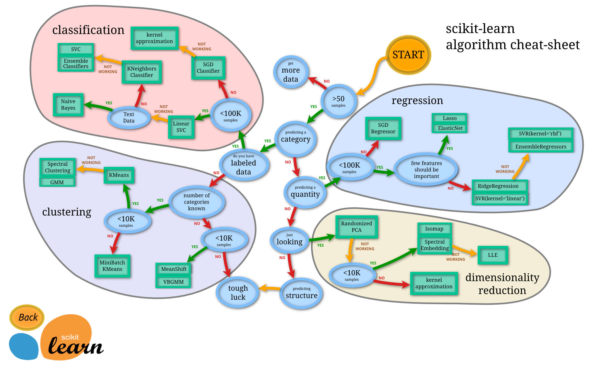
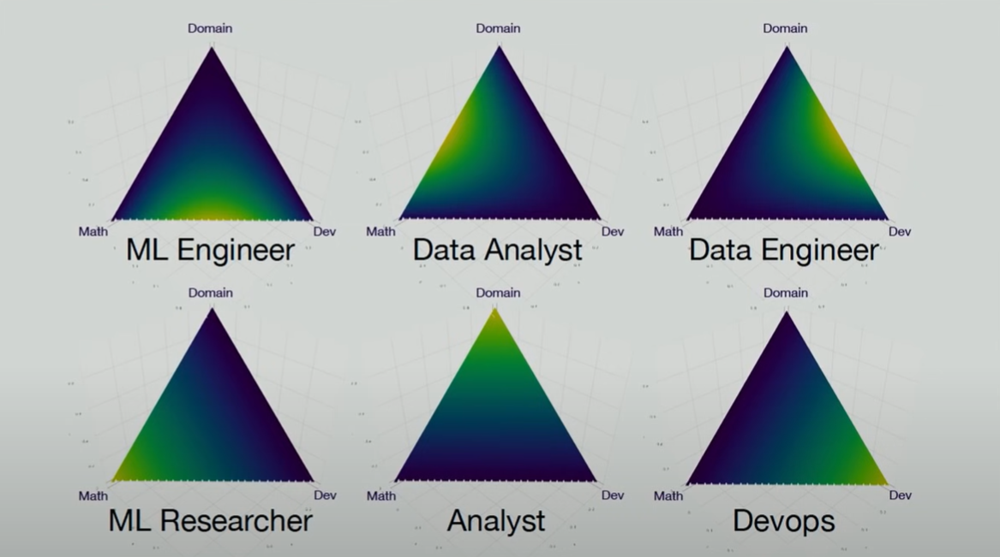

# Введение в Data Science

## Начало



Профессия дата сайентиста пользуется успехом, и вместе с популярностью растет количество различных специализаций. Очень заметным стало отделение технологических профессий от бизнес-направления:

**Data Analyst (аналитик данных)**

- Фокус: анализ и интерпретация данных.
- Что делает: Работает с готовыми данными (обычно уже очищенными и хранящимися в БД/BI-системах). Делает отчёты, дашборды, визуализации. 
Отвечает на бизнес-вопросы ("Почему продажи упали?", "Какая кампания дала лучший результат?"). Использует SQL, Excel, Tableau/PowerBI, Python (pandas, matplotlib).
- По сути, превращает данные в понятные бизнесу выводы.

**Data Engineer (инженер данных)**

- Фокус: инфраструктура и обработка данных.
- Что делает: Строит пайплайны для сбора, очистки и хранения данных. Настраивает базы данных, хранилища (Data Lake, Data Warehouse). Оптимизирует скорость обработки больших объёмов информации. Работает с ETL/ELT, Spark, Kafka, Airflow, SQL/NoSQL, Python/Scala/Go.
- Делает так, чтобы данные были доступны, надёжны и готовы к анализу.

**Data Scientist (учёный по данным)**

- Фокус: продвинутый анализ и модели.
- Что делает: Использует статистику и машинное обучение для прогнозов и автоматизации. Решает задачи вроде: "Спрогнозировать отток клиентов", "Рекомендовать товары". Разрабатывает модели ML/AI и проверяет их точность. Работает с Python (scikit-learn, PyTorch, TensorFlow), статистикой, математикой, ML/DL, NLP.
- Берёт данные и строит умные модели, которые приносят бизнесу новые возможности.

В двух словах:

- Data Analyst → отвечает на вопрос: «Что произошло и почему?»
- Data Engineer → обеспечивает: «Чтобы данные были и были качественные»
- Data Scientist → предсказывает: «Что будет дальше и что с этим делать»



## Немного Аналитики и Терминов

**Независимая переменная** (independent variable, X) — это то, что влияет на результат и может изменяться или контролироваться исследователем. Её часто называют фактором, предиктором или признаком. Например, это может быть бюджет на рекламу, количество звонков клиентам, температура воздуха или число часов, потраченных на учёбу.

**Зависимая переменная** (dependent variable, Y) — это то, что изменяется под воздействием независимой переменной. Она отражает результат, который мы измеряем. В аналитике её также называют целью, outcome или target. Примеры зависимых переменных: продажи, которые зависят от объёма рекламы, конверсия — от числа звонков, продажи мороженого — от температуры воздуха, а оценка на экзамене — от количества часов подготовки.

Таким образом, в аналитике 
- независимые переменные (X) выступают как входные данные или факторы
- зависимая переменная (Y) — это то, что мы предсказываем или анализируем.


**Дисперсия** – это мера разброса данных. Она показывает, насколько сильно значения отличаются от среднего.

$$
D = \frac{1}{n-1} \sum_{i=1}^{n} (x_i - \bar{x})^2
$$

- $x_i$ — отдельное значение  
- $\bar{x}$ — среднее значение:  
  $$
  \bar{x} = \frac{1}{n} \sum_{i=1}^{n} x_i
  $$  
- $n$ — количество элементов

### Регрессия и Классификации

`Регрессия` — это метод в статистике и машинном обучении, который позволяет изучать зависимость между переменными. В регрессии мы пытаемся понять, как изменения одной или нескольких независимых переменных (факторов) влияют на зависимую переменную (результат), а также строим модель для прогнозирования. Главная цель регрессии — количественно описать связь между входными факторами и результатом, чтобы делать предсказания или анализировать влияние переменных.

- `Линейная регрессия` (Linear Regression) — модельирует зависимость как линейную комбинацию факторов. Пример: прогноз продаж по бюджету на рекламу.


$$
y = \beta_0 + \beta_1 x_1 + \beta_2 x_2 + \dots + \beta_n x_n + \varepsilon
$$

- $y$ — зависимая переменная (число)
- $x_i$ — факторы
- $\beta_i$ — коэффициенты
- $\varepsilon$ — случайная ошибка

- `Полиномиальная регрессия` (Polynomial Regression) — расширение линейной регрессии, где учитываются степени факторов для моделирования кривых зависимостей.
- `Регрессия с регуляризацией` (Ridge, Lasso, ElasticNet) — предотвращает переобучение и улучшает прогноз на новых данных.
- `Деревья решений для регрессии` (Decision Tree Regressor) — модель делит пространство факторов на сегменты и предсказывает среднее значение в каждом сегменте.
- `Случайный лес и градиентный бустинг` (Random Forest, Gradient Boosting Regressor) — ансамбли деревьев, повышающие точность прогнозов.
- `Методы ближайших соседей` (KNN Regressor) — прогноз на основе средних значений соседей по факторным признакам.


`Классификация` — это метод машинного обучения, который применяется, когда результатом является категория или класс, а не числовое значение. Цель классификации — присвоить объекту правильный класс на основе наблюдаемых признаков. Классификация помогает разделять объекты на группы и принимать решения на основе анализа факторов.

- `Логистическая регрессия` (Logistic Regression) — для бинарной или многоклассовой классификации. Пример: отток клиента, клики по рекламе.

$$
P(y=1 \mid X) = \frac{1}{1 + e^{-(\beta_0 + \beta_1 x_1 + \dots + \beta_n x_n)}}
$$


- `Деревья решений` (Decision Tree Classifier) — классифицируют объекты через последовательные разбиения признаков.
- `Случайный лес` (Random Forest Classifier) — ансамбль деревьев для повышения стабильности и точности.
- `Градиентный бустинг` (Gradient Boosting Classifier, XGBoost, LightGBM)   построение последовательных моделей для исправления ошибок предыдущих.
- `Методы ближайших соседей` (KNN Classifier) — присваивают объекту класс большинства соседей.
- `Поддерживающие векторы` (SVM) — строят границу (гиперплоскость) для разделения классов.
- `Нейронные сети` (Neural Networks) — применяются для сложных классификаций, распознавания изображений, текста или последовательностей.


## jupyter

```bash
python -m notebook
``` 

Или через усманову `Переменные среды`

```bash
jupyter notebook 
```
