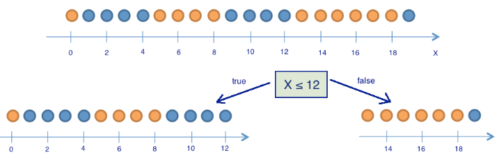

# Введение в Data Science

- [Введение в Data Science](#введение-в-data-science)
  - [Начало](#начало)
  - [Немного Аналитики и Терминов](#немного-аналитики-и-терминов)
    - [Регрессия и Классификации](#регрессия-и-классификации)
  - [jupyter](#jupyter)
- [mlcourse.ai](#mlcourseai)
  - [Классификация, деревья решений и метод ближайших соседей](#классификация-деревья-решений-и-метод-ближайших-соседей)
    - [Введение](#введение)
    - [Дерево решений](#дерево-решений)
    - [Алгоритм построения дерева](#алгоритм-построения-дерева)
    - [Другие критерии качества разбиения в задаче классификации](#другие-критерии-качества-разбиения-в-задаче-классификации)
    - [Основные параметры дерева](#основные-параметры-дерева)
    - [Дерево решений в задаче регрессии](#дерево-решений-в-задаче-регрессии)
    - [Метод ближайших соседей](#метод-ближайших-соседей)
    - [Класс KNeighborsClassifier в Scikit-learn](#класс-kneighborsclassifier-в-scikit-learn)
    - [Выбор параметров модели и кросс-валидация](#выбор-параметров-модели-и-кросс-валидация)
    - [Плюсы и минусы деревьев решений и метода ближайших соседей](#плюсы-и-минусы-деревьев-решений-и-метода-ближайших-соседей)
  - [Линейные модели классификации и регрессии](#линейные-модели-классификации-и-регрессии)
    - [Метод наименьших квадратов](#метод-наименьших-квадратов)

## Начало


Профессия дата сайентиста пользуется успехом, и вместе с популярностью растет количество различных специализаций. Очень заметным стало отделение технологических профессий от бизнес-направления:

**Data Analyst (аналитик данных)**

- Фокус: анализ и интерпретация данных.
- Что делает: Работает с готовыми данными (обычно уже очищенными и хранящимися в БД/BI-системах). Делает отчёты, дашборды, визуализации. 
Отвечает на бизнес-вопросы ("Почему продажи упали?", "Какая кампания дала лучший результат?"). Использует SQL, Excel, Tableau/PowerBI, Python (pandas, matplotlib).
- По сути, превращает данные в понятные бизнесу выводы.

**Data Engineer (инженер данных)**

- Фокус: инфраструктура и обработка данных.
- Что делает: Строит пайплайны для сбора, очистки и хранения данных. Настраивает базы данных, хранилища (Data Lake, Data Warehouse). Оптимизирует скорость обработки больших объёмов информации. Работает с ETL/ELT, Spark, Kafka, Airflow, SQL/NoSQL, Python/Scala/Go.
- Делает так, чтобы данные были доступны, надёжны и готовы к анализу.

**Data Scientist (учёный по данным)**

- Фокус: продвинутый анализ и модели.
- Что делает: Использует статистику и машинное обучение для прогнозов и автоматизации. Решает задачи вроде: "Спрогнозировать отток клиентов", "Рекомендовать товары". Разрабатывает модели ML/AI и проверяет их точность. Работает с Python (scikit-learn, PyTorch, TensorFlow), статистикой, математикой, ML/DL, NLP.
- Берёт данные и строит умные модели, которые приносят бизнесу новые возможности.

В двух словах:

- Data Analyst → отвечает на вопрос: «Что произошло и почему?»
- Data Engineer → обеспечивает: «Чтобы данные были и были качественные»
- Data Scientist → предсказывает: «Что будет дальше и что с этим делать»


## Немного Аналитики и Терминов

**Независимая переменная** (independent variable, X) — это то, что влияет на результат и может изменяться или контролироваться исследователем. Её часто называют фактором, предиктором или признаком. Например, это может быть бюджет на рекламу, количество звонков клиентам, температура воздуха или число часов, потраченных на учёбу.

**Зависимая переменная** (dependent variable, Y) — это то, что изменяется под воздействием независимой переменной. Она отражает результат, который мы измеряем. В аналитике её также называют целью, outcome или target. Примеры зависимых переменных: продажи, которые зависят от объёма рекламы, конверсия — от числа звонков, продажи мороженого — от температуры воздуха, а оценка на экзамене — от количества часов подготовки.

Таким образом, в аналитике 
- независимые переменные (X) выступают как входные данные или факторы
- зависимая переменная (Y) — это то, что мы предсказываем или анализируем.


**Дисперсия** – это мера разброса данных. Она показывает, насколько сильно значения отличаются от среднего.

$$
D = \frac{1}{n-1} \sum_{i=1}^{n} (x_i - \bar{x})^2
$$

- $x_i$ — отдельное значение  
- $\bar{x}$ — среднее значение:  
  $$
  \bar{x} = \frac{1}{n} \sum_{i=1}^{n} x_i
  $$  
- $n$ — количество элементов

### Регрессия и Классификации

`Регрессия` — это метод в статистике и машинном обучении, который позволяет изучать зависимость между переменными. В регрессии мы пытаемся понять, как изменения одной или нескольких независимых переменных (факторов) влияют на зависимую переменную (результат), а также строим модель для прогнозирования. Главная цель регрессии — количественно описать связь между входными факторами и результатом, чтобы делать предсказания или анализировать влияние переменных.

- `Линейная регрессия` (Linear Regression) — модельирует зависимость как линейную комбинацию факторов. Пример: прогноз продаж по бюджету на рекламу.

$$
y = \beta_0 + \beta_1 x_1 + \beta_2 x_2 + \dots + \beta_n x_n + \varepsilon
$$

- $y$ — зависимая переменная (число)
- $x_i$ — факторы
- $\beta_i$ — коэффициенты
- $\varepsilon$ — случайная ошибка

- `Полиномиальная регрессия` (Polynomial Regression) — расширение линейной регрессии, где учитываются степени факторов для моделирования кривых зависимостей.
- `Регрессия с регуляризацией` (Ridge, Lasso, ElasticNet) — предотвращает переобучение и улучшает прогноз на новых данных.
- `Деревья решений для регрессии` (Decision Tree Regressor) — модель делит пространство факторов на сегменты и предсказывает среднее значение в каждом сегменте.
- `Случайный лес и градиентный бустинг` (Random Forest, Gradient Boosting Regressor) — ансамбли деревьев, повышающие точность прогнозов.
- `Методы ближайших соседей` (KNN Regressor) — прогноз на основе средних значений соседей по факторным признакам.


`Классификация` — это метод машинного обучения, который применяется, когда результатом является категория или класс, а не числовое значение. Цель классификации — присвоить объекту правильный класс на основе наблюдаемых признаков. Классификация помогает разделять объекты на группы и принимать решения на основе анализа факторов.

- `Логистическая регрессия` (Logistic Regression) — для бинарной или многоклассовой классификации. Пример: отток клиента, клики по рекламе.

$$
P(y=1 \mid X) = \frac{1}{1 + e^{-(\beta_0 + \beta_1 x_1 + \dots + \beta_n x_n)}}
$$


- `Деревья решений` (Decision Tree Classifier) — классифицируют объекты через последовательные разбиения признаков.
- `Случайный лес` (Random Forest Classifier) — ансамбль деревьев для повышения стабильности и точности.
- `Градиентный бустинг` (Gradient Boosting Classifier, XGBoost, LightGBM)   построение последовательных моделей для исправления ошибок предыдущих.
- `Методы ближайших соседей` (KNN Classifier) — присваивают объекту класс большинства соседей.
- `Поддерживающие векторы` (SVM) — строят границу (гиперплоскость) для разделения классов.
- `Нейронные сети` (Neural Networks) — применяются для сложных классификаций, распознавания изображений, текста или последовательностей.


## jupyter

```bash
python -m notebook
``` 

Или через усманову `Переменные среды`

```bash
jupyter notebook 
```

# mlcourse.ai

https://mlcourse.ai/book/index.html

[mlcourse.ai](https://github.com/Yorko/mlcourse.ai?tab=readme-ov-file) - это открытый курс по машинному обучению от OpenDataScience (ods.ai)


## Классификация, деревья решений и метод ближайших соседей

https://habr.com/ru/companies/ods/articles/322534/

### Введение

Наверное, хочется сразу рвануть в бой, но сначала поговорим про то, какую именно задачу будем решать и каково ее место в области машинного обучения.
Классическое, общее (и не больно-то строгое) определение машинного обучения звучит так (T. Mitchell "Machine learning", 1997):

> говорят, что компьютерная программа обучается при решении какой-то задачи из класса T, если ее производительность, согласно метрике P, улучшается при накоплении опыта E.
Далее в разных сценариях под T, P, и E подразумеваются совершенно разные вещи. Среди самых популярных задач T в машинном обучении:

- `классификация` – отнесение объекта к одной из категорий на основании его признаков
- `регрессия` – прогнозирование количественного признака объекта на основании прочих его признаков
- `кластеризация` – разбиение множества объектов на группы на основании признаков этих объектов так, чтобы внутри групп объекты были похожи между собой, а вне одной группы – менее похожи
- `детекция аномалий` – поиск объектов, "сильно непохожих" на все остальные в выборке либо на какую-то группу объектов
и много других, более специфичных. Хороший обзор дан в главе "Machine Learning basics" книги ["Deep Learning"](https://www.deeplearningbook.org/) (Ian Goodfellow, Yoshua Bengio, Aaron Courville, 2016)

Под **опытом E** понимаются данные (без них никуда), и в зависимости от этого алгоритмы машинного обучения могут быть поделены на те, что обучаются с учителем и без учителя (supervised & unsupervised learning). В задачах обучения без учителя имеется выборка, состоящая из объектов, описываемых набором признаков. В задачах обучения с учителем вдобавок к этому для каждого объекта некоторой выборки, называемой обучающей, известен целевой признак – по сути это то, что хотелось бы прогнозировать для прочих объектов, не из обучающей выборки.

Задачи `классификации` и `регрессии` относятся к обучению с `учителем`. Пример – кредитный скоринг: на основе данных о клиентах нужно прогнозировать невозврат кредита. Обучающая выборка состоит из объектов (людей) с признаками (возраст, зарплата, тип кредита, прошлые невозвраты и т.д.) и целевым признаком.
Если целевой признак – факт невозврата (0 или 1), это задача бинарной `классификации`. Если же нужно предсказывать время задержки возврата, это задача регрессии.

Метрика оценки качества **алгоритма (P)** зависит от задачи. Для `классификации` самая простая метрика – доля правильных ответов (accuracy, не путать с precision).

Далее будем рассматривать классификацию и регрессию.

### Дерево решений

Методы классификации и регрессии начнём с дерева решений – одного из самых популярных. Деревья решений применяются в разных сферах, не только в машинном обучении. По сути, это наглядная инструкция «что делать в какой ситуации». Например, Высшая Школа Экономики выпускает такие схемы для сотрудников, в том числе по публикации статей на портале института.


В терминах машинного обучения это простой классификатор: он определяет форму публикации (книга, статья, глава, препринт, публикация в СМИ) по признакам — тип публикации, тип издания и другим.

`Дерево решений` как алгоритм машинного обучения — это набор логических правил («если признак $a < x$ и признак $b < $y, то класс 1»), оформленный в виде дерева. Его главное преимущество — интерпретируемость: легко объяснить, почему алгоритм выдал тот или иной результат (например, отказ в кредите из-за отсутствия жилья и низкого дохода). В отличие от «чёрных ящиков» других моделей, деревья близки к человеческой логике принятия решений. Благодаря этому они получили широкую популярность, а алгоритм вошёл в список 10 лучших методов интеллектуального анализа данных (2008) ("Top 10 algorithms in data mining", Knowledge and Information Systems, 2008. [PDF](https://raw.githubusercontent.com/csuldw/MachineLearning/master/doc/10Algorithms-08.pdf)).

Энтропия Шеннона для системы с $N$ состояниями определяется как

$\Large S = -\sum_{i=1}^{N}p_i \log_2{p_i},$

где $p_i$ — вероятность $i$-го состояния. Интуитивно энтропия отражает степень хаоса: чем она выше, тем система менее упорядочена. В машинном обучении это позволяет формализовать понятие «эффективного разделения выборки» (например, в задаче «20 вопросов»).

**Пример:**

Для иллюстрации того, как энтропия поможет определить хорошие признаки для построения дерева, приведем тот же игрушечный пример, что в статье "Энтропия и деревья принятия решений". Будем предсказывать цвет шарика по его координате. Конечно, ничего общего с жизнью это не имеет, но позволяет показать, как энтропия используется для построения дерева решений.


Здесь 9 синих шариков и 11 желтых. Если мы наудачу вытащили шарик, то он с вероятностью $p_1=\frac{9}{20}$ будет синим и с вероятностью $p_2=\frac{11}{20}$ – желтым. Значит, энтропия состояния $S_0 = -\frac{9}{20}\log_2{\frac{9}{20}}-\frac{11}{20}\log_2{\frac{11}{20}} \approx 1$. Само это значение пока ни о чем нам не говорит. Теперь посмотрим, как изменится энтропия, если разбить шарики на две группы – с координатой меньше либо равной 12 и больше 12.



В левой группе оказалось 13 шаров, из которых 8 синих и 5 желтых. Энтропия этой группы равна $S_1 = -\frac{5}{13}\log_2{\frac{5}{13}}-\frac{8}{13}\log_2{\frac{8}{13}} \approx 0.96$. В правой группе оказалось 7 шаров, из которых 1 синий и 6 желтых. Энтропия правой группы равна $S_2 = -\frac{1}{7}\log_2{\frac{1}{7}}-\frac{6}{7}\log_2{\frac{6}{7}} \approx 0.6$. Как видим, энтропия уменьшилась в обеих группах по сравнению с начальным состоянием, хоть в левой и не сильно. Поскольку энтропия – по сути степень хаоса (или неопределенности) в системе, уменьшение энтропии называют приростом информации. Формально прирост информации (information gain, IG) при разбиении выборки по признаку $Q$ (в нашем примере это признак "$x \leq 12$") определяется как

$\Large IG(Q) = S_O - \sum_{i=1}^{q}\frac{N_i}{N}S_i,$

где $q$ – число групп после разбиения, $N_i$ – число элементов выборки, у которых признак $Q$ имеет $i$-ое значение. В нашем случае после разделения получилось две группы ($q = 2$) – одна из 13 элементов ($N_1 = 13$), вторая – из 7 ($N_2 = 7$). Прирост информации получился

$\Large IG(x \leq 12) = S_0 - \frac{13}{20}S_1 - \frac{7}{20}S_2 \approx 0.16$

Получается, разделив шарики на две группы по признаку "координата меньше либо равна 12", мы уже получили более упорядоченную систему, чем в начале. Продолжим деление шариков на группы до тех пор, пока в каждой группе шарики не будут одного цвета.


Для правой группы потребовалось всего одно дополнительное разбиение по признаку "координата меньше либо равна 18", для левой – еще три. Очевидно, энтропия группы с шариками одного цвета равна 0 ($\log_2{1} = 0$), что соответствует представлению, что группа шариков одного цвета – упорядоченная.
В итоге мы построили дерево решений, предсказывающее цвет шарика по его координате. Отметим, что такое дерево решений может плохо работать для новых объектов (определения цвета новых шариков), поскольку оно идеально подстроилось под обучающую выборку (изначальные 20 шариков). Для классификации новых шариков лучше подойдет дерево с меньшим числом "вопросов", или разделений, пусть даже оно и не идеально разбивает по цветам обучающую выборку. Эту проблему, переобучение, мы еще рассмотрим далее.

### Алгоритм построения дерева

Можно убедиться в том, что построенное в предыдущем примере дерево является в некотором смысле оптимальным – потребовалось только 5 "вопросов" (условий на признак $x$), чтобы "подогнать" дерево решений под обучающую выборку, то есть чтобы дерево правильно классифицировало любой обучающий объект. При других условиях разделения выборки дерево получится глубже.

В основе популярных алгоритмов построения дерева решений, таких как ID3 и C4.5, лежит принцип жадной максимизации прироста информации – на каждом шаге выбирается тот признак, при разделении по которому прирост информации оказывается наибольшим. Дальше процедура повторяется рекурсивно, пока энтропия не окажется равной нулю или какой-то малой величине (если дерево не подгоняется идеально под обучающую выборку во избежание переобучения).

В разных алгоритмах применяются разные эвристики для "ранней остановки" или "отсечения", чтобы избежать построения переобученного дерева.

```python
def build(L):
    # create node t
    if the stopping criterion is True:
        # assign a predictive model to t
    else:
        # Find the best binary split L = L_left + L_right
        t.left = build(L_left)
        t.right = build(L_right)
    return t  
```

### Другие критерии качества разбиения в задаче классификации

Мы разобрались в том, как понятие энтропии позволяет формализовать представление о качестве разбиения в дереве. Но это всего лишь эвристика, существуют и другие:

- `Неопределенность Джини `(Gini impurity): $G = 1 - \sum\limits_k (p_k)^2$. Максимизацию этого критерия можно интерпретировать как максимизацию числа пар объектов одного класса, оказавшихся в одном поддереве. Подробнее об этом (как и обо многом другом) можно узнать из [репозитория](https://github.com/esokolov/ml-course-hse) Евгения Соколова. Не путать с индексом Джини! Подробнее об этой путанице – в [блогпосте](https://alexanderdyakonov.wordpress.com/2015/12/15/%D0%B7%D0%BD%D0%B0%D0%BA%D0%BE%D0%BC%D1%8C%D1%82%D0%B5%D1%81%D1%8C-%D0%B4%D0%B6%D0%B8%D0%BD%D0%B8/) Александра Дьяконова
- Ошибка классификации (misclassification error): $E = 1 - \max\limits_k p_k$

На практике ошибка классификации почти не используется, а `неопределенность Джини` и прирост информации работают почти одинаково.

В случае задачи бинарной классификации ($p_+$ – вероятность объекта иметь метку +) энтропия и `неопределенность Джини` примут следующий вид:

$S = -p_+ \log_2{p_+} -p_- \log_2{p_-} = -p_+ \log_2{p_+} -(1 - p_{+}) \log_2{(1 - p_{+})};$

$G = 1 - p_+^2 - p_-^2 = 1 - p_+^2 - (1 - p_+)^2 = 2p_+(1-p_+).$

Когда мы построим графики этих двух функций от аргумента $p_+$, то увидим, что график энтропии очень близок к графику удвоенной неопределенности Джини, и поэтому на практике эти два критерия "работают" почти одинаково.

<details>
<summary>Код для отрисовки</summary>

```python
from __future__ import division, print_function
# отключим всякие предупреждения Anaconda
import warnings
warnings.filterwarnings('ignore')

import numpy as np
import pandas as pd
%matplotlib inline
import seaborn as sns
from matplotlib import pyplot as plt

plt.rcParams['figure.figsize'] = (6,4) # Устанавливаем размеры графиков по умолчанию

xx = np.linspace(0,1,50) # Создаём сетку значений вероятности класса p+ от 0 до 1

# Строим графики различных критериев качества узла в дереве
plt.plot(xx, [2 * x * (1-x) for x in xx], label='gini')          # индекс Джини
plt.plot(xx, [4 * x * (1-x) for x in xx], label='2*gini')        # индекс Джини, умноженный на 2
plt.plot(xx, [-x * np.log2(x) - (1-x) * np.log2(1 - x)  for x in xx], label='entropy')  # энтропия
plt.plot(xx, [1 - max(x, 1-x) for x in xx], label='missclass')   # критерий ошибки классификации
plt.plot(xx, [2 - 2 * max(x, 1-x) for x in xx], label='2*missclass') # удвоенная ошибка классификации

# Подписи осей
plt.xlabel('p+')
plt.ylabel('criterion')

plt.title('Критерии качества как функции от p+ (бинарная классификация)')
plt.legend()
```

</details>


**Пример**

Рассмотрим пример применения дерева решений из библиотеки `Scikit-learn` для синтетических данных. Два класса будут сгенерированы из двух нормальных распределений с разными средними.

<details>
<summary>Код для генерации данных</summary>

```python
np.random.seed(7)
train_data = np.random.normal(size=(100, 2))
train_labels = np.zeros(100)

# добавляем второй класс
train_data = np.r_[train_data, np.random.normal(size=(100, 2), loc=2)]
train_labels = np.r_[train_labels, np.ones(100)]

array([0., 0., 0., 0., 0., 0., 0., 0., 0., 0., 0., 0., 0., 0., 0., 0., 0.,
       0., 0., 0., 0., 0., 0., 0., 0., 0., 0., 0., 0., 0., 0., 0., 0., ...])
```

</details>

`Задача классификации` – построить границу, разделяющую два класса (красные и желтые точки). Слишком простая граница может быть неточной, слишком сложная – переобучиться. Хорошо на новых данных обычно работает гладкая граница или прямая (гиперплоскость в $n$-мерном случае).

<details>
<summary>Отрисовка картинки</summary>

```python
plt.rcParams['figure.figsize'] = (10,8)
plt.scatter(train_data[:, 0], train_data[:, 1], c=train_labels, s=100, cmap='autumn', edgecolors='black', linewidth=1.5)
plt.plot(range(-2,5), range(4,-3,-1))
```

</details>


Попробуем разделить эти два класса, обучив дерево решений. В дереве будем использовать параметр `max_depth`, ограничивающий глубину дерева. Визуализируем полученную границу разделения классов.

<details>
<summary>Код для обучения дерева и отрисовки его разделяющей границы</summary>

```python
from sklearn.tree import DecisionTreeClassifier

# Напишем вспомогательную функцию, которая будет возвращать решетку для дальнейшей визуализации.
def get_grid(data):
    x_min, x_max = data[:, 0].min() - 1, data[:, 0].max() + 1
    y_min, y_max = data[:, 1].min() - 1, data[:, 1].max() + 1
    return np.meshgrid(np.arange(x_min, x_max, 0.01), np.arange(y_min, y_max, 0.01))

# параметр min_samples_leaf указывает, при каком минимальном количестве
# элементов в узле он будет дальше разделяться
clf_tree = DecisionTreeClassifier(criterion='entropy', max_depth=3, random_state=17)

# обучаем дерево
clf_tree.fit(train_data, train_labels)

# немного кода для отображения разделяющей поверхности
xx, yy = get_grid(train_data)
predicted = clf_tree.predict(np.c_[xx.ravel(), yy.ravel()]).reshape(xx.shape)

plt.pcolormesh(xx, yy, predicted, cmap='autumn')
plt.scatter(train_data[:, 0], train_data[:, 1], c=train_labels, s=100, cmap='autumn', edgecolors='black', linewidth=1.5)
```

</details>


А как выглядит само построенное дерево? Видим, что дерево "нарезает" пространство на 7 прямоугольников (в дереве 7 листьев). В каждом таком прямоугольнике прогноз дерева будет константным, по превалированию объектов того или иного класса.

<details>
<summary>Код для отображения дерева</summary>

```python
from sklearn import tree
import matplotlib.pyplot as plt

plt.figure(figsize=(10,6))
tree.plot_tree(clf_tree, feature_names=['x1', 'x2'], filled=True, rounded=True, fontsize=9)
plt.show()
```

</details>


Изначально 200 объектов делились поровну на два класса, энтропия была максимальной (1). После разбиения по признаку $x_1 > 1.103$ энтропия в обеих группах уменьшилась. Дерево строится до глубины 3. Цвет вершины отражает состав класса: больше объектов одного класса – темно-оранжевый, другого – темно-синий; в корне, где классы поровну, вершина белая.

**Пример**

Есть выборка с признаками Возраст и Зарплата и целевым классом "Невозврат кредита".

Дерево решений сортирует объекты по возрасту и ищет пороги, где меняется класс. Так, возрастные пороги оказались: 19, 22.5, 30, 32 и 43.5 лет. Например, 43.5 — это среднее между клиентами 38 (не вернул кредит) и 49 лет (вернул кредит).

Аналогично для зарплаты: пороги 30.5 и 95 тыс. руб/мес, выбираемые по тем же правилам.

Дерево сравнивает все возможные пороги, оценивает прирост информации (снижение энтропии) и выбирает только те, которые лучше разделяют классы.

**Идея**: дерево использует не все значения признака, а лишь ключевые, где меняется целевой класс, чтобы строить информативные разбиения.

Если хочешь, я могу нарисовать мини-схему дерева для этого примера, чтобы было визуально понятно, как выбираются пороги.

**Основное**:

- Дерево решений с количественными признаками ищет бинарные разбиения вида "Признак < порог".
- Проверяются только те пороги, где целевой класс меняется, а не все возможные значения признака.
- При множестве количественных признаков отбираются только лучшие пороги, дающие максимальный прирост информации (снижение энтропии или Джини).
- Это позволяет избежать перебора огромного числа возможных разбиений и ускоряет обучение дерева.

**Вывод**: Эвристика: сортируем количественный признак и проверяем только пороги, где меняется целевой класс; при множестве признаков выбираются топ-N порогов с наибольшим приростом информации. Это делает построение дерева эффективным и информативным.

### Основные параметры дерева

Дерево решений можно строить до такой глубины, чтобы в каждом листе был один объект, но на практике это приводит к переобучению — дерево слишком подстраивается под обучающую выборку и плохо работает на новых данных. На больших глубинах появляются разбиения по незначимым признакам (например, город клиента), что ведёт к слишком специфичным правилам. Исключения:

- `Случайный лес` — усредняет ответы многих деревьев, построенных до максимальной глубины.
- `Стрижка дерева` (pruning) — дерево строится до максимальной глубины, затем некоторые вершины удаляются снизу вверх, оценивая качество дерева через кросс-валидацию.

Основные параметры класса `sklearn.tree.DecisionTreeClassifier`:

- `max_depth` – максимальная глубина дерева
- `max_features` — максимальное число признаков, по которым ищется лучшее разбиение в дереве (это нужно потому, что при большом количестве признаков будет "дорого" искать лучшее (по критерию типа прироста информации) разбиение среди всех признаков)
- `min_samples_leaf` – минимальное число объектов в листе. У этого параметра есть понятная интерпретация: скажем, если он равен 5, то дерево будет порождать только те классифицирующие правила, которые верны как минимум для 5 объектов

### Дерево решений в задаче регрессии

При прогнозировании количественного признака идея построения дерева остается та же, но меняется критерий качества:

Дисперсия вокруг среднего: $\Large D = \frac{1}{\ell} \sum\limits_{i =1}^{\ell} (y_i - \frac{1}{\ell} \sum\limits_{i =1}^{\ell} y_i)^2,$
где $\ell$ – число объектов в листе, $y_i$ – значения целевого признака. Попросту говоря, минимизируя дисперсию вокруг среднего, мы ищем признаки, разбивающие выборку таким образом, что значения целевого признака в каждом листе примерно равны.

**Пример**

Сгенерируем данные, распределенные вокруг функции $f(x) = e^{-x ^ 2} + 1.5 * e^{-(x - 2) ^ 2}$ c некоторым шумом, обучим на них дерево решений и изобразим, какие прогнозы делает дерево.

<details>
<summary>Код</summary>

```python
# Количество точек для обучения и теста, а также уровень шума
n_train = 150        # размер обучающей выборки
n_test = 1000        # размер тестовой выборки
noise = 0.1          # дисперсия шума

# Задаём "истинную" функцию, которую будем аппроксимировать
def f(x):
    x = x.ravel()  # превращаем в одномерный массив
    return np.exp(-x ** 2) + 1.5 * np.exp(-(x - 2) ** 2)

# Функция генерации данных с шумом
def generate(n_samples, noise):
    X = np.random.rand(n_samples) * 10 - 5  # равномерно распределённые x из диапазона [-5, 5]
    X = np.sort(X).ravel() # сортировка для красивого графика
    # значения функции + случайный шум
    y = np.exp(-X ** 2) + 1.5 * np.exp(-(X - 2) ** 2) + \
        np.random.normal(0.0, noise, n_samples)

    X = X.reshape((n_samples, 1)) # приводим X к двумерному виду (матрица признаков)
    return X, y

# Генерация обучающей и тестовой выборки
X_train, y_train = generate(n_samples=n_train, noise=noise)
X_test, y_test = generate(n_samples=n_test, noise=noise)

# Импорт модели решающего дерева для регрессии
from sklearn.tree import DecisionTreeRegressor

reg_tree = DecisionTreeRegressor(max_depth=5, random_state=17) # Создаём дерево глубиной 5

reg_tree.fit(X_train, y_train) # Обучаем дерево на тренировочных данных

reg_tree_pred = reg_tree.predict(X_test) # Получаем предсказания на тестовых данных
plt.figure(figsize=(10, 6)) # Визуализация


plt.plot(X_test, f(X_test), "b") # Истинная функция (синяя линия)
plt.scatter(X_train, y_train, c="b", s=20 )# Обучающие точки (синие точки)
plt.plot(X_test, reg_tree_pred, "g", lw=2) # Предсказания модели (зелёная линия)
plt.xlim([-5, 5]) # Ограничиваем ось X диапазоном [-5, 5]
plt.title("Decision tree regressor, MSE = %.2f" % np.sum((y_test - reg_tree_pred) ** 2)) # Заголовок с метрикой ошибки (сумма квадратов ошибок)
plt.show()
```

</details>


Видим, что дерево решений аппроксимирует зависимость в данных кусочно-постоянной функцией.

### Метод ближайших соседей

`Метод ближайших соседей` (kNN) — популярный и интуитивно понятный метод классификации (иногда используется для регрессии). Суть: тестовый объект относится к классу, который преобладает среди его ближайших соседей. Основой метода является гипотеза компактности: схожие объекты чаще принадлежат одному классу, если метрика расстояния выбрана удачно.

Пример: тестовый объект (зелёный шарик) будет отнесён к классу «синие», а не «красные». Так как находится ближе к «синим»

Для классификации объекта методом kNN выполняются три шага:

- Вычислить расстояния до всех объектов обучающей выборки.
- Выбрать $k$ ближайших соседей.

Отнести объект к классу, который встречается чаще всего среди соседей.

Для регрессии вместо класса возвращается среднее или медианное значение целевого признака.

Особенность метода — ленивость: вычисления происходят только при классификации тестового объекта, в отличие от деревьев решений, где сначала строится модель.

kNN хорошо изучен и на «бесконечных» выборках является оптимальным методом классификации. Его ограничивает лишь вычислительная сложность и проклятие размерностей.

- В чистом виде kNN может послужить хорошим стартом (baseline) в решении какой-либо задачи;
- В соревнованиях Kaggle kNN часто используется для построения мета-признаков (прогноз kNN подается на вход прочим моделям) или в стекинге/блендинге;
- Идея ближайшего соседа расширяется и на другие задачи, например, в рекомендательных системах простым начальным решением может быть рекомендация какого-то товара (или услуги), популярного среди ближайших соседей человека, которому хотим сделать рекомендацию;

### Класс KNeighborsClassifier в Scikit-learn

Основные параметры класса sklearn.neighbors.KNeighborsClassifier:

- `weights`: "uniform" (все веса равны), "distance" (вес обратно пропорционален расстоянию до тестового примера) или другая определенная пользователем функция
- `algorithm` (опционально): "`brute`", "`ball_tree`", "`KD_tree`", или "`auto`". В первом случае ближайшие соседи для каждого тестового примера считаются перебором обучающей выборки. Во втором и третьем — расстояние между примерами хранятся в дереве, что ускоряет нахождение ближайших соседей. В случае указания параметра "`auto`" подходящий способ нахождения соседей будет выбран автоматически на основе обучающей выборки.
- `leaf_size` (опционально): порог переключения на полный перебор в случае выбора `BallTree` или `KDTree` для нахождения соседей
- metric: "`minkowski`", "`manhattan`", "`euclidean`", "`chebyshev`" и другие

### Выбор параметров модели и кросс-валидация

`Главная цель обучаемых алгоритмов` — обобщение, то есть хорошая работа на новых данных. Поскольку истинные значения целевого признака на новых данных неизвестны, часть данных выделяют для проверки качества модели.

Два распространённых подхода:

- `Отложенная выборка` (hold-out) — оставляют 20–40% данных для теста, обучают модель на оставшихся 60–80% и оценивают метрику качества (например, точность) на отложенной выборке.
- `Кросс-валидация` (cross-validation) — данные делят на K частей (folds), поочерёдно используют каждую часть для теста, а остальные для обучения, усредняя результаты.

model-parameters-and-cross-validation.png


При K-fold кросс-валидации модель обучается K раз на разных подвыборках (K-1 для обучения, 1 для проверки). Полученные K оценок качества усредняются, давая среднюю метрику модели.

Кросс-валидация обычно точнее, чем отложенная выборка, но требует больше вычислений при больших данных. Она важна для выбора гиперпараметров, сравнения моделей и оценки полезности признаков.

[Оценка модели, выбор модели и выбор алгоритма в машинном обучении](https://sebastianraschka.com/blog/2016/model-evaluation-selection-part1.html)

### Плюсы и минусы деревьев решений и метода ближайших соседей

Плюсы и минусы деревьев решений

**Плюсы**:

- Порождение четких правил классификации, понятных человеку, например, "если возраст < 25 и интерес к мотоциклам, то отказать в кредите". Это свойство называют интерпретируемостью модели;
- Деревья решений могут легко визуализироваться, то есть может "интерпретироваться" (строгого определения я не видел) как сама модель (дерево), так и прогноз для отдельного взятого тестового объекта (путь в дереве);
- Быстрые процессы обучения и прогнозирования;
- Малое число параметров модели;
- Поддержка и числовых, и категориальных признаков.

**Минусы**:

- У порождения четких правил классификации есть и другая сторона: деревья очень чувствительны к шумам во входных данных, вся модель может кардинально измениться, если немного изменится обучающая выборка (например, если убрать один из признаков или добавить несколько объектов), поэтому и правила классификации могут сильно изменяться, что ухудшает интерпретируемость модели;
- Разделяющая граница, построенная деревом решений, имеет свои ограничения (состоит из гиперплоскостей, перпендикулярных какой-то из координатной оси), и на практике дерево решений по качеству классификации уступает некоторым другим методам;
- Необходимость отсекать ветви дерева (pruning) или устанавливать минимальное число элементов в листьях дерева или максимальную глубину дерева для борьбы с переобучением. Впрочем, переобучение — проблема всех методов машинного обучения;
- Нестабильность. Небольшие изменения в данных могут существенно изменять построенное дерево решений. С этой проблемой борются с помощью ансамблей деревьев решений (рассмотрим далее);
- Проблема поиска оптимального дерева решений (минимального по размеру и способного без ошибок классифицировать выборку) NP-полна, поэтому на практике используются эвристики типа жадного поиска признака с максимальным приростом информации, которые не гарантируют нахождения глобально оптимального дерева;
- Сложно поддерживаются пропуски в данных. Friedman оценил, что на поддержку пропусков в данных ушло около 50% кода CART (классический алгоритм построения деревьев классификации и регрессии – Classification And Regression Trees, в sklearn реализована улучшенная версия именно этого алгоритма);
- Модель умеет только интерполировать, но не экстраполировать (это же верно и для леса и бустинга на деревьях). То есть дерево решений делает константный прогноз для объектов, находящихся в признаковом пространстве вне параллелепипеда, охватывающего все объекты обучающей выборки. В нашем примере с желтыми и синими шариками это значит, что модель дает одинаковый прогноз для всех шариков с координатой > 19 или < 0.

Плюсы и минусы метода ближайших соседей

**Плюсы**:

- Простая реализация;
- Неплохо изучен теоретически;
- Как правило, метод хорош для первого решения задачи, причем не только классификации или регрессии, но и, например, рекомендации;
- Можно адаптировать под нужную задачу выбором метрики или ядра (в двух словах: ядро может задавать операцию сходства для сложных объектов типа графов, а сам подход kNN остается тем же). Кстати, профессор ВМК МГУ и опытный участник соревнований по анализу данных Александр Дьяконов любит самый простой kNN, но с настроенной метрикой сходства объектов. Можно почитать про некоторые его решения в этой статье;
- Неплохая интерпретация, можно объяснить, почему тестовый пример был классифицирован именно так. Хотя этот аргумент можно атаковать: если число соседей большое, то интерпретация ухудшается (условно: "мы не дали ему кредит, потому что он похож на 350 клиентов, из которых 70 – плохие, что на 12% больше, чем в среднем по выборке").

**Минусы**:

- Метод считается быстрым в сравнении, например, с композициями алгоритмов, но в реальных задачах, как правило, число соседей, используемых для классификации, будет большим (100-150), и в таком случае алгоритм будет работать не так быстро, как дерево решений;
- Если в наборе данных много признаков, то трудно подобрать подходящие веса и определить, какие признаки не важны для классификации/регрессии;
- Зависимость от выбранной метрики расстояния между примерами. Выбор по умолчанию евклидового расстояния чаще всего ничем не обоснован. Можно отыскать хорошее решение перебором параметров, но для большого набора данных это отнимает много времени;
- Нет теоретических оснований выбора определенного числа соседей — только перебор (впрочем, чаще всего это верно для всех гиперпараметров всех моделей). В случае малого числа соседей метод чувствителен к выбросам, то есть склонен переобучаться;
- Как правило, плохо работает, когда признаков много, из-за "прояклятия размерности". Про это хорошо рассказывает известный в ML-сообществе профессор Pedro Domingos – тут в популярной статье "A Few Useful Things to Know about Machine Learning", также "the curse of dimensionality" описывается в книге Deep Learning в главе "Machine Learning basics".

На этом мы подходим к концу, надеемся, этой статьи Вам хватит надолго. К тому же, есть еще и домашнее задание.

ДЗ: https://nbviewer.org/github/Yorko/mlcourse.ai/blob/main/jupyter_russian/assignments_demo/assignment03_decision_trees.ipynb


## Линейные модели классификации и регрессии

https://habr.com/ru/companies/ods/articles/323890/


### Метод наименьших квадратов

Рассказ про линейные модели мы начнем с линейной регрессии. В первую очередь, необходимо задать модель зависимости объясняемой переменной $y$ от объясняющих ее факторов, функция зависимости будет линейной: $y = w_0 + \sum_{i=1}^m w_i x_i$. Если мы добавим фиктивную размерность $x_0 = 1$ для каждого наблюдения, тогда линейную форму можно переписать чуть более компактно, записав свободный член $w_0$ под сумму: $y = \sum_{i=0}^m w_i x_i = \vec{w}^T \vec{x}$. Если рассматривать матрицу наблюдения-признаки, у которой в строках находятся примеры из набора данных, то нам необходимо добавить единичную колонку слева. Зададим модель следующим образом:

$\large \vec y = X \vec w + \epsilon,$

где

- $\vec y \in \mathbb{R}^n$ – объясняемая (или целевая) переменная;
- $w$ – вектор параметров модели (в машинном обучении эти параметры часто называют весами);
- $X$ – матрица наблюдений и признаков размерности $n$ строк на $m + 1$ столбцов (включая фиктивную единичную колонку слева) с полным рангом по столбцам: $\text{rank}\left(X\right) = m + 1$;
- $\epsilon$ – случайная переменная, соответствующая случайной, непрогнозируемой ошибке модели.

Можем выписать выражение для каждого конкретного наблюдения

$\large y_i = \sum_{j=0}^m w_j X_{ij} + \epsilon_i$

Также на модель накладываются следующие ограничения (иначе это будет какая то другая регрессия, но точно не линейная):

- матожидание случайных ошибок равно нулю: $\forall i: \mathbb{E}\left[\epsilon_i\right] = 0$;
- дисперсия случайных ошибок одинакова и конечна, это свойство называется - гомоскедастичностью: $\forall i: \text{Var}\left(\epsilon_i\right) = \sigma^2 < \infty$;
- случайные ошибки не скоррелированы: $\forall i \neq j: \text{Cov}\left(\epsilon_i, \epsilon_j\right) = 0$.

> `Гомоскедастичность` — это термин из статистики и эконометрики, который описывает ситуацию, когда дисперсия ошибок (или случайных отклонений) одинакова для всех значений объясняющей переменной. Проще говоря, разброс ошибок не зависит от того, где вы находитесь на графике регрессии.
> 
> 
> 
> 


Оценка $\hat{w}_i$ весов $w_i$ называется линейной, если

$\large \hat{w}_i = \omega_{1i}y_1 + \omega_{2i}y_2 + \cdots + \omega_{ni}y_n$


где $\forall\ k\ \omega_{ki}$ зависит только от наблюдаемых данных $X$ и почти наверняка нелинейно. Так как решением задачи поиска оптимальных весов будет именно линейная оценка, то и модель называется линейной регрессией. Введем еще одно определение. Оценка $\hat{w}_i$ называется несмещенной тогда, когда матожидание оценки равно реальному, но неизвестному значению оцениваемого параметра:


$\large \mathbb{E}\left[\hat{w}_i\right] = w_i$


Один из способов вычислить значения параметров модели является **метод наименьших квадратов** (МНК), который минимизирует среднеквадратичную ошибку между реальным значением зависимой переменной и прогнозом, выданным моделью:


$\large \begin{array}{rcl}\mathcal{L}\left(X, \vec{y}, \vec{w} \right) &=& \frac{1}{2n} \sum_{i=1}^n \left(y_i - \vec{w}^T \vec{x}_i\right)^2 \\ &=& \frac{1}{2n} \left\| \vec{y} - X \vec{w} \right\|_2^2 \\ &=& \frac{1}{2n} \left(\vec{y} - X \vec{w}\right)^T \left(\vec{y} - X \vec{w}\right) \end{array}$

**Сумма квадратов ошибок**

$\mathcal{L}\left(X, \vec{y}, \vec{w} \right) = \frac{1}{2n} \sum_{i=1}^n \left(y_i - \vec{w}^T \vec{x}_i\right)^2$

**Где:**

- $y_i$ — реальное значение зависимой переменной для $i$-го объекта  
- $\vec{x}_i$ — вектор признаков $i$-го объекта  
- $\vec{w}$ — вектор параметров модели  
- $n$ — число объектов  

> Деление на $2n$ удобно для вычисления производных при минимизации функции потерь.

---

**Векторная запись**

$\mathcal{L}(X, \vec{y}, \vec{w}) = \frac{1}{2n} \left\| \vec{y} - X \vec{w} \right\|_2^2$

**Где:**

- $X$ — матрица признаков размера $n \times d$  
- $\vec{y}$ — вектор всех истинных значений  
- $\|\cdot\|_2^2$ — сумма квадратов элементов вектора (евклидова норма)

---

**Квадратичная форма**

$\mathcal{L}(X, \vec{y}, \vec{w}) = \frac{1}{2n} (\vec{y} - X \vec{w})^T (\vec{y} - X \vec{w})$

Эквивалентно предыдущей записи, но удобно для дифференцирования и аналитического решения уравнений МНК.

Для решения данной оптимизационной задачи необходимо вычислить производные по параметрам модели, приравнять их к нулю и решить полученные уравнения относительно $\vec w$ (матричное дифференцирование неподготовленному читателю может показаться затруднительным, попробуйте расписать все через суммы, чтобы убедиться в ответе):

**Шпаргалка по матричным производным**

$\frac{\partial}{\partial x} x^T a = a$

$\frac{\partial}{\partial x} x^T A x = (A + A^T)x$

$\frac{\partial}{\partial A} x^T A y = x y^T$

$\frac{\partial}{\partial x} A^{-1} = - A^{-1} \frac{\partial A}{\partial x} A^{-1}$

Решение:

$\large \begin{array}{rcl} \frac{\partial \mathcal{L}}{\partial \vec{w}} &=& \frac{\partial}{\partial \vec{w}} \frac{1}{2n} \left( \vec{y}^T \vec{y} -2\vec{y}^T X \vec{w} + \vec{w}^T X^T X \vec{w}\right) \\ &=& \frac{1}{2n} \left(-2 X^T \vec{y} + 2X^T X \vec{w}\right) \end{array}$

$\large \begin{array}{rcl} \frac{\partial \mathcal{L}}{\partial \vec{w}} = 0 &\Leftrightarrow& \frac{1}{2n} \left(-2 X^T \vec{y} + 2X^T X \vec{w}\right) = 0 \\ &\Leftrightarrow& -X^T \vec{y} + X^T X \vec{w} = 0 \\ &\Leftrightarrow& X^T X \vec{w} = X^T \vec{y} \\ &\Leftrightarrow& \vec{w} = \left(X^T X\right)^{-1} X^T \vec{y} \end{array}$

Итак, имея в виду все определения и условия описанные выше, мы можем утверждать, опираясь на **теорему Маркова-Гаусса**, что оценка МНК является лучшей оценкой параметров модели, среди всех линейных и несмещенных оценок, то есть обладающей наименьшей дисперсией.

Это значение $\vec{w}$ минимизирует среднеквадратичную ошибку.