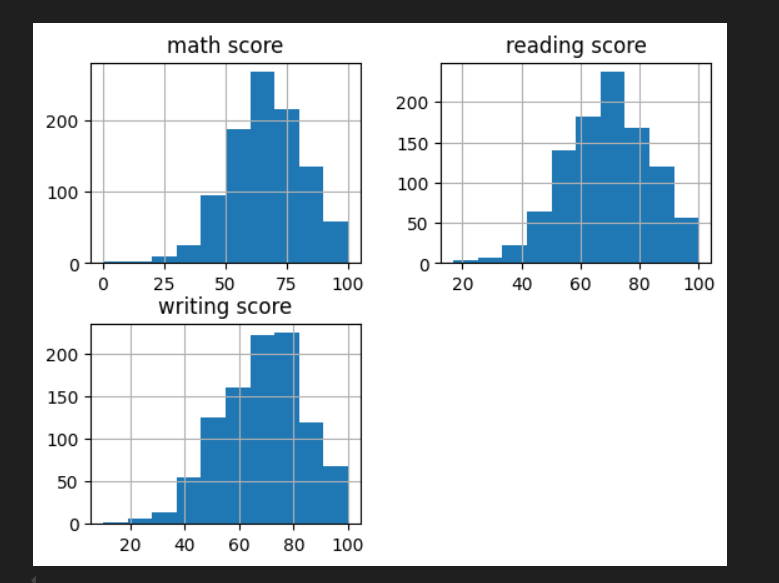
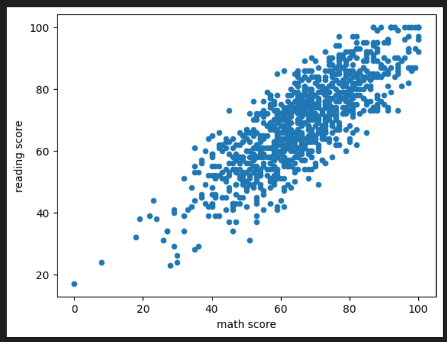
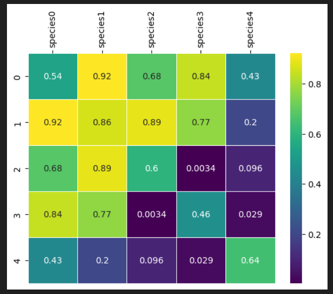

## Pandas

`pandas` это высокоуровневая Python библиотека для анализа данных. Почему я её называю высокоуровневой, потому что построена она поверх более низкоуровневой библиотеки `NumPy` (написана на Си), что является большим плюсом в производительности. 

- [Pandas](#pandas)
  - [Series](#series)
  - [DataFrame](#dataframe)
    - [Доступ по индексу в DataFrame](#доступ-по-индексу-в-dataframe)
  - [Чтение и запись данных](#чтение-и-запись-данных)
  - [Фильтровать данные](#фильтровать-данные)
  - [Подробную информацию о таблице](#подробную-информацию-о-таблице)
  - [Группировка и агрегирование в pandas](#группировка-и-агрегирование-в-pandas)
  - [Сводные таблицы в pandas](#сводные-таблицы-в-pandas)
  - [Анализ временных рядов](#анализ-временных-рядов)
  - [Визуализация](#визуализация)

### Series

Структура/объект `Series` представляет из себя объект, похожий на одномерный массив (питоновский список, например), но отличительной его чертой является наличие ассоциированных меток, т.н. индексов, вдоль каждого элемента из списка. Такая особенность превращает его в ассоциативный массив или словарь в Python.

```python
import pandas as pd # принятое соглашения для алиас
my_series = pd.Series([5, 6, 7, 8, 9, 10])
my_series
0     5
1     6
2     7
3     8
4     9
5    10
dtype: int64
```

У объекта Series есть атрибуты через которые можно получить список элементов и индексы, это values и index соответственно.

```python
>>> my_series.index
RangeIndex(start=0, stop=6, step=1)

>>> my_series.values
array([ 5,  6,  7,  8,  9, 10], dtype=int64)
```

Индексы можно задавать явно:

```python
>>> my_series2 = pd.Series([5, 6, 7, 8, 9, 10], index=['a', 'b', 'c', 'd', 'e', 'f'])
>>> my_series2['f']
10
```

Имейте в виду, что список с индексами по длине должен совпадать с количеством элементов в Series.

Фильтровать `Series` как душе заблагорассудится, а также применять математические операции и многое другое:

```python
>>> my_series2[my_series2 > 0]
c    7
d    8
e    9
dtype: int64

>>> my_series2[my_series2 > 0] * 2
c    14
d    16
e    18
dtype: int64
```

### DataFrame

Объект `DataFrame` лучше всего представлять себе в виде обычной таблицы и это правильно, ведь DataFrame является табличной структурой данных. В любой таблице всегда присутствуют строки и столбцы. Столбцами в объекте DataFrame выступают объекты Series, строки которых являются их непосредственными элементами.

`DataFrame` проще всего сконструировать на примере питоновского словаря:

```python
>>> df = pd.DataFrame({
...     'country': ['Kazakhstan', 'Russia', 'Belarus', 'Ukraine'],
...     'population': [17.04, 143.5, 9.5, 45.5],
...     'square': [2724902, 17125191, 207600, 603628]
... })

>>> df
   country  population    square
0  Kazakhstan       17.04   2724902
1      Russia      143.50  17125191
2     Belarus        9.50    207600
3     Ukraine       45.50    603628
```

Чтобы убедиться, что столбец в `DataFrame` это `Series`, извлекаем любой:

```python
>>> df['country']
0    Kazakhstan
1        Russia
2       Belarus
3       Ukraine
Name: country, dtype: object

>>> type(df['country'])
<class 'pandas.core.series.Series'>
```

Объект `DataFrame` имеет 2 индекса: по строкам и по столбцам. Если индекс по строкам явно не задан (например, колонка по которой нужно их строить), то `pandas` задаёт целочисленный индекс RangeIndex от 0 до N-1, где N это количество строк в таблице.

```python
>>> df.columns
Index([u'country', u'population', u'square'], dtype='object')

>>> df.index
RangeIndex(start=0, stop=4, step=1)
```

В таблице у нас 4 элемента от 0 до 3. 

#### Доступ по индексу в DataFrame

Индекс по строкам можно задать разными способами, например, при формировании самого объекта `DataFrame` или "на лету":

```python
>>> df = pd.DataFrame({
...     'country': ['Kazakhstan', 'Russia', 'Belarus', 'Ukraine'],
...     'population': [17.04, 143.5, 9.5, 45.5],
...     'square': [2724902, 17125191, 207600, 603628]
... }, index=['KZ', 'RU', 'BY', 'UA'])

>>> df
       country  population    square
KZ  Kazakhstan       17.04   2724902
RU      Russia      143.50  17125191
BY     Belarus        9.50    207600
UA     Ukraine       45.50    603628

>>> df.index = ['KZ', 'RU', 'BY', 'UA']

>>> df.index.name = 'Country Code'

>>> df
                    country  population    square
Country Code                                     
          KZ     Kazakhstan       17.04   2724902
          RU         Russia      143.50  17125191
          BY        Belarus        9.50    207600
          UA        Ukraine       45.50    603628
```

Как видно, индексу было задано имя - Country Code. Отмечу, что объекты `Series` из `DataFrame` будут иметь те же индексы, что и объект `DataFrame`:

```python
>>> df['country']
KZ        Kazakhstan
RU          Russia
BY          Belarus
UA          Ukraine
Name: country, dtype: object
```

**Доступ к строкам по индексу возможен несколькими способами:**

- `.loc` - используется для доступа по строковой метке (Этот вывод является одномерным (вертикальным), так как он представляет собой отдельный ряд данных.)
- `.iloc` - используется для доступа по числовому значению (начиная от 0)

```python
>>> df.loc['KZ']
country       Kazakhstan
population         17.04
square           2724902
Name: KZ, dtype: object
```

```python
>>> df.iloc[0]
country       Kazakhstan
population         17.04
square           2724902
Name: KZ, dtype: object
```

Можно делать выборку по индексу и интересующим колонкам:

```python
>>> df.loc[['KZ', 'RU'], 'population']
Country Code
KZ            17.04
RU            43.50
Name: population, dtype: float64
```

Как можно заметить, `.loc` в квадратных скобках принимает 2 аргумента: интересующий индекс, в том числе поддерживается слайсинг и колонки.

```python
>>> df.loc['KZ':'BY', :]
                   country  population    square
Country Code                                  
          KZ    Kazakhstan       17.04   2724902
          RU        Russia      143.50  17125191
          BY       Belarus        9.50    207600

>>> df.loc[['BY'], ["square"]]
                square
Country Code        
          RU  17125191
```

```python
>>> df.iloc[0:3, 0:5]
                   country  population    square
Country Code                                  
          KZ    Kazakhstan       17.04   2724902
          RU        Russia      143.50  17125191
          BY       Belarus        9.50    207600
```

`0:3`: Это диапазон для строк. Он выбирает строки с индексами от 0 до 2 (включительно). В pandas диапазон не включает верхнюю границу, поэтому 0:3 означает, что будут выбраны строки с индексами 0, 1 и 2. Так же можно просто массив `[1, 4, 5]`

`0:5`: Это диапазон для столбцов. Он выбирает столбцы с индексами от 0 до 4 (включительно). Таким образом, будут выбраны столбцы с индексами 0, 1, 2, 3 и 4.


Сбросить индексы можно вот так:

```python
>>> df.reset_index()
  Country Code     country  population    square
0           KZ  Kazakhstan       17.04   2724902
1           RU      Russia      143.50  17125191
2           BY     Belarus        9.50    207600
3           UA     Ukraine       45.50    603628
```

pandas при операциях над `DataFrame`, возвращает новый объект `DataFrame`.

Добавим новый столбец, в котором население (в миллионах) поделим на площадь страны, получив тем самым плотность:

```python
>>> df['density'] = df['population'] / df['square'] * 1000000
>>> df
                   country  population    square    density
Country Code                                             
          KZ    Kazakhstan       17.04   2724902   6.253436
          RU        Russia      143.50  17125191   8.379469
          BY       Belarus        9.50    207600  45.761079
          UA       Ukraine       45.50    603628  75.377550
```

Не нравится новый столбец? Не проблема, удалим его:

```python
>>> df.drop(['density'], axis='columns')
                  country  population    square
Country Code                                  
          KZ   Kazakhstan       17.04   2724902
          RU       Russia      143.50  17125191
          BY      Belarus        9.50    207600
          UA      Ukraine       45.50    603628
```

Особо ленивые могут просто написать `del df['density']`.

Переименовывать столбцы нужно через метод `rename`:

```python
>>> df = df.rename(columns={'Country Code': 'country_code'})
>>> df
  country_code     country  population    square
0           KZ  Kazakhstan       17.04   2724902
1           RU      Russia      143.50  17125191
2           BY     Belarus        9.50    207600
3           UA     Ukraine       45.50    603628
```

В этом примере перед тем как переименовать столбец Country Code, убедитесь, что с него сброшен индекс, иначе не будет никакого эффекта.

### Чтение и запись данных

`pandas` поддерживает все самые популярные форматы хранения данных: csv, excel, sql, буфер обмена, html и многое другое:

Чаще всего приходится работать с csv-файлами. Например, чтобы сохранить наш DataFrame со странами, достаточно написать:

```python
>>> df.to_csv('filename.csv')
```

Считать данные из csv-файла и превратить в `DataFrame` можно функцией `read_csv`.

```python
>>> df = pd.read_csv('filename.csv', sep=',')
```
Аргумент sep указывает разделитесь столбцов. Существует ещё масса способов сформировать `DataFrame` из различных источников, но наиболее часто используют CSV, Excel и SQL. Например, с помощью функции read_sql, pandas может выполнить SQL запрос и на основе ответа от базы данных сформировать необходимый `DataFrame`.

```python
df = pd.read_csv("filename.csv", sep=",")

# SQL-запрос прямо к DataFrame
result = duckdb.query("SELECT column_name, COUNT(*) FROM df GROUP BY column_name").to_df()
```

Первые/последние строки для осмотра данных

```python
titanic_df.head()   # первые 5 строк
titanic_df.tail()  # последние 5 строк

titanic_df.tail(3)  # последние 3 строк
```

### Фильтровать данные

Фильтровать `DataFrame` с помощью т.н. булевых массивов:

```python
>>> df[df.population > 10][['country', 'square']]
                   country    square
Country Code                      
          KZ    Kazakhstan   2724902
          RU        Russia  17125191
          UA       Ukraine    603628
```

Кстати, к столбцам можно обращаться, используя атрибут или нотацию словарей Python, т.е. `df.population и df['population']` это одно и то же.

Pandas использует побитовый тип `&` `|`. Кроме того, каждое условие должно быть заключено в `( )`.

Это работает:

```python
data_query = df[(df['year'] >= 2005) & (df['year'] <= 2010)]

# Error
# df = df[(df['col'] < -0.25) or (df['col'] > 0.25)]
```

`pandas.DataFrame.query()` — это удобный способ фильтровать строки датафрейма с помощью выражений в виде строки.

```python
min_age = 30
max_score = 90

df_filtered = df.query('Age >= @min_age and Score <= @max_score')


# Отбираем строки, где math score > 30 и reading score > 80
filtered = df.query('`math score` > 30 and `reading score` > 80')
```

Отберёт студентов, уровень образования родителей которых бакалавр или магистр, `isin` - проверяет содержат ли элементы в последовательности значения.

```
studentsPerformance[studentsPerformance['parental level of education'].isin(["bachelor's degree", "master's degree"])]
```

`filter()` используется для выбора колонок или строк по именам, шаблонам или маске, а не для фильтрации по значениям (для этого лучше `query()` или логические условия).

```python
# Выбираем колонки, которые начинаются с "math"
math_cols = df.filter(like="math")

# Только эти колонки
df_selected = df.filter(items=["math score", "reading score"])

# Колонки, оканчивающиеся на "score"
df_score = df.filter(regex="score$")

# Только строки с индексами 0, 1, 2
df_rows = df.filter(items=[0, 1, 2], axis=0)
# axis=0 → строки, axis=1 → колонки (по умолчанию).
```

Можно использовать только один из аргументов items, like, regex

### Подробную информацию о таблице

Типы данных и базовая информация

```python
>>> titanic_df.dtypes  # типы колонок
PassengerID      int64
Name            object
PClass          object
Age            float64
Sex             object
Survived         int64
SexCode          int64
dtype: object

>>> titanic_df.info()  # количество ненулевых значений, типы, память
<class 'pandas.core.frame.DataFrame'>
RangeIndex: 1313 entries, 0 to 1312
Data columns (total 7 columns):
 #   Column       Non-Null Count  Dtype  
---  ------       --------------  -----  
 0   PassengerID  1313 non-null   int64  
 1   Name         1313 non-null   object 
 2   PClass       1313 non-null   object 
 3   Age          756 non-null    float64
 4   Sex          1313 non-null   object 
 5   Survived     1313 non-null   int64  
 6   SexCode      1313 non-null   int64  
dtypes: float64(1), int64(3), object(3)
memory usage: 71.9+ KB
```

Размер таблицы

```python
>>> print(titanic_df.shape)   # (количество строк, количество колонок)
(1313, 7)

>>> print(titanic_df.size)    # общее количество элементов
9191
```

Возвращает ряд, содержащий частоту каждой отдельной строки во фрейме данных.

```python
>>> titanic_df.value_counts()
studentsPerformance = pd.read_csv('resources/titanic.csv')

PassengerID  Name                                           PClass  Age    Sex     Survived  SexCode
1            Allen, Miss Elisabeth Walton                   1st     29.00  female  1         1          1
2            Allison, Miss Helen Loraine                    1st     2.00   female  0         1          1
3            Allison, Mr Hudson Joshua Creighton            1st     30.00  male    0         0          1
4            Allison, Mrs Hudson JC (Bessie Waldo Daniels)  1st     25.00  female  0         1          1
5            Allison, Master Hudson Trevor                  1st     0.92   male    1         0          1
                                                                                                       ..
1309         Zakarian, Mr Artun                             3rd     27.00  male    0         0          1
1310         Zakarian, Mr Maprieder                         3rd     26.00  male    0         0          1
1311         Zenni, Mr Philip                               3rd     22.00  male    0         0          1
1312         Lievens, Mr Rene                               3rd     24.00  male    0         0          1
1313         Zimmerman, Leo                                 3rd     29.00  male    0         0          1
Name: count, Length: 756, dtype: int64
```

Базовая статистика по числовым колонкам

```python
>>> titanic_df.describe()  # count, mean, std, min, 25%, 50%, 75%, max

       PassengerID         Age     Survived      SexCode
count  1313.000000  756.000000  1313.000000  1313.000000
mean    657.000000   30.397989     0.342727     0.351866
std     379.174762   14.259049     0.474802     0.477734
min       1.000000    0.170000     0.000000     0.000000
25%     329.000000   21.000000     0.000000     0.000000
50%     657.000000   28.000000     0.000000     0.000000
75%     985.000000   39.000000     1.000000     1.000000
max    1313.000000   71.000000     1.000000     1.000000
```

Статистика по категориальным колонкам

```python
>>> titanic_df.describe(include=['object', 'category']))

Name PClass   Sex
count                      1313   1313  1313
unique                     1310      4     2
top     Carlsson, Mr Frans Olof    3rd  male
freq                          2    711   851
```

Проверка на пропущенные значения

```python
>>> titanic_df.isnull().sum()  # количество пропусков в каждой колонке
PassengerID      0
Name             0
PClass           0
Age            557
Sex              0
Survived         0
SexCode          0
dtype: int64
```

```python
>>> titanic_df.nunique()       # количество уникальных значений в колонках
PassengerID    1313
Name           1310
PClass            4
Age              75
Sex               2
Survived          2
SexCode           2
dtype: int64
```

### Группировка и агрегирование в pandas

Группировка данных один из самых часто используемых методов при анализе данных. В pandas за группировку отвечает метод .groupby. Я долго думал какой пример будет наиболее наглядным, чтобы продемонстрировать группировку, решил взять стандартный набор данных (dataset), использующийся во всех курсах про анализ данных — данные о пассажирах Титаника. Скачать CSV файл можно [тут](resources/titanic.csv).

```python
>>> titanic_df = pd.read_csv('titanic.csv')
>>> print(titanic_df.head())
   PassengerID                                           Name PClass    Age  \
0            1                   Allen, Miss Elisabeth Walton    1st  29.00   
1            2                    Allison, Miss Helen Loraine    1st   2.00   
2            3            Allison, Mr Hudson Joshua Creighton    1st  30.00   
3            4  Allison, Mrs Hudson JC (Bessie Waldo Daniels)    1st  25.00   
4            5                  Allison, Master Hudson Trevor    1st   0.92   
      Sex  Survived  SexCode  
0  female         1        1  
1  female         0        1  
2    male         0        0  
3  female         0        1  
4    male         1        0 
```

Необходимо подсчитать, сколько женщин и мужчин выжило, а сколько нет. В этом нам поможет метод `.groupby`.

```python
>>> print(titanic_df.groupby(['Sex', 'Survived'])['PassengerID'].count())
Sex     Survived
female  0           154
        1           308
male    0           709
        1           142
Name: PassengerID, dtype: int64
```

А теперь проанализируем в разрезе класса кабины:

```python
>>> print(titanic_df.groupby(['PClass', 'Survived'])['PassengerID'].count())
PClass  Survived
*       0             1
1st     0           129
        1           193
2nd     0           160
        1           119
3rd     0           573
        1           138
Name: PassengerID, dtype: int64
```

`mean` (Среднее арифметическое) — это сумма всех значений, делённая на их количество

```python
# Оба кода рабочие и выдают идентичный результат, но обработку делают показному

>> concentrations.groupby("genus").mean(["sucrose", "alanin", "citrate", "glucose", "oleic_acid"])

>>> concentrations.groupby("genus")[["sucrose", "alanin", "citrate", "glucose", "oleic_acid"]].mean()

# тоже самое но больше писать
>>> mean_concentraions = concentrations.groupby('genus').aggregate(
    mean_suc = ('sucrose', 'mean'),
    mean_alanin = ('alanin', 'mean'),
    mean_citrate = ('citrate', 'mean'),
    mean_glucose = ('glucose', 'mean'),
    mean_oleic_acid = ('oleic_acid', 'mean')
)
```

Методу `.mean()` в пандасе не передаются в качестве аргументов столбцы. Он применяется ко всему датасету автоматом считая среднее у всех числовых колонок. Т.е. в первом случае вы сгруппировали датасет и посчитали по всем среднюю, а во втором - сгруппировали датасет и выбрали только числовые колонки, а потом от них уже и брали среднюю, что `mean` делает и так. 


`aggregate` (или его сокращение `agg`) используется для применения одной или нескольких функций к колонкам датафрейма.

```python
result = students_performance.groupby('gender').aggregate({'math score': 'mean'})
result.head()
        math score
gender
female   63.633205
male     68.728216


result = students_performance.groupby('gender', as_index=False).aggregate({'math score': ['mean', 'count', 'std'],'reading score': ['std', 'min', 'max']})
gender math score                  reading score         
                mean count        std           std min  max
0  female  63.633205   518  15.491453     14.378245  17  100
1    male  68.728216   482  14.356277     13.931832  23  100


>>> students_performance.groupby(['gender', 'lunch'])['math score'].nunique()
gender  lunch       
female  free/reduced    63
        standard        65
male    free/reduced    56
        standard        59
Name: math score, dtype: int64
```

Сортировка по значениям вдоль любой оси используем `sort_values`

```python
df.sort_values(['gender', 'math_score'], ascending=[True, False])
```

Получить данные и округлить до 2-ого знака

```python
np.around(concentrations.query("genus == 'Fucus'").alanin.describe().loc[['min', 'mean', 'max']].values, decimals=2)

# или

concentrations.query("genus == 'Fucus'").alanin.describe().loc[['min', 'mean', 'max']].apply(lambda x: round(x, 2))
```

`var` (Дисперсия) – это мера разброса данных. Она показывает, насколько сильно значения отличаются от среднего.

```python
concentrations.groupby("group")[['citrate', 'sucrose']].var()
```

**Задача**: К нам поступили данные из бухгалтерии о заработках Лупы и Пупы за разные задачи! Посмотрите у кого из них больше средний заработок в различных категориях (колонка Type) и заполните таблицу, указывая исполнителя с большим заработком в каждой из категорий.

```
,Executor,Type,Salary
0,Pupa,D,63
1,Pupa,A,158
2,Pupa,D,194
3,Pupa,E,109
4,Loopa,E,184
5,Loopa,F,232
```

```python
>>> st_prf.groupby(['Executor', 'Type']).mean()

                Unnamed:_0      Salary
Executor Type                        
Loopa    A      46.000000   58.000000
         B      24.000000  145.166667
         C      31.666667  154.333333
Pupa     A      16.000000  160.833333
         B      41.000000   77.000000
         C      23.000000   74.500000
# ...

# Понял что нужно только Salary  

>>> st_prf.groupby(['Executor', 'Type'])['Salary'].mean()

# теперь нужно перевернуть данные
>>> st_prf.groupby(['Executor', 'Type'])['Salary'].mean().unstack()

Type               A           B           C           D      E       F
Executor                                                               
Loopa      58.000000  145.166667  154.333333  137.714286  164.0  238.00
Pupa      160.833333   77.000000   74.500000  146.500000  131.2  136.25
```

### Сводные таблицы в pandas

Термин "сводная таблица" хорошо известен тем, кто не по наслышке знаком с инструментом Microsoft Excel или любым иным, предназначенным для обработки и анализа данных. В pandas сводные таблицы строятся через метод `.pivot_table`. За основу возьмём всё тот же пример с Титаником. Например, перед нами стоит задача посчитать сколько всего женщин и мужчин было в конкретном классе корабля:

```python
>>> titanic_df = pd.read_csv('titanic.csv')
>>> pvt = titanic_df.pivot_table(index=['Sex'], columns=['PClass'], values='Name', aggfunc='count')
```

В качестве индекса теперь у нас будет пол человека, колонками станут значения из PClass, функцией агрегирования будет count (подсчёт количества записей) по колонке Name.

```python
>>> pvt
PClass	*	    1st	    2nd	    3rd
Sex				
female	NaN	  143.0	  107.0	  212.0
male	 1.0	  179.0	  172.0	  499.0

>>> print(pvt.loc['female', ['1st', '2nd', '3rd']])
PClass
1st    143.0
2nd    107.0
3rd    212.0
Name: female, dtype: float64
```

Назначьте новые столбцы фрейму данных - `assign`

```python
st_prf.columns = st_prf.columns.str.replace(' ', '_')

st_prf['total_score'] = st_prf.math_score + st_prf.reading_score + st_prf.writing_score
st_prf = st_prf.assign(total_score_log = np.log(st_prf.total_score))

# или

st_prf = students_performance.assign(
    total_score = lambda df: df["math score"] + df["reading score"] + df["writing score"],
    total_score_log = lambda df: np.log(df["math score"] + df["reading score"] + df["writing score"])
)
```

### Анализ временных рядов

Я вижу, что у тебя загружен Titanic dataset, но это не временной ряд (там нет даты/времени). Для анализа временных рядов нужен столбец с датой (например, Date, Year, Month или точная дата событий).

```python
np.random.seed(42)
titanic_df["TicketDate"] = pd.date_range("1911-01-01", periods=len(titanic_df), freq="D")

# Преобразуем в datetime (если нужно)
titanic_df["TicketDate"] = pd.to_datetime(titanic_df["TicketDate"])

# Устанавливаем индекс как дату
titanic_df.set_index("TicketDate", inplace=True)

# Посчитаем количество пассажиров по дням
daily_counts = titanic_df['PassengerID'].resample('D').count()

# Преобразуем в месяцы с помощью resample
monthly_counts = titanic_df['PassengerID'].resample('ME').count()

print(daily_counts.head())
# TicketDate
# 1911-01-01    1
# 1911-01-02    1
# 1911-01-03    1
# 1911-01-04    1
# 1911-01-05    1
# Freq: D, Name: PassengerID, dtype: int64

print(monthly_counts.head())
# TicketDate
# 1911-01-31    31
# 1911-02-28    28
# 1911-03-31    31
# 1911-04-30    30
# 1911-05-31    31
# Freq: ME, Name: PassengerID, dtype: int64
```

### Визуализация

`.hist()` - построит график

```python
students_performance = pd.read_csv('resources/StudentsPerformance.csv')

students_performance.hist()
```



`students_performance.plot.scatter(x='math score', y='reading score')` - Создайте точечную диаграмму с различными размерами и цветом точек маркера.

```python
students_performance.plot.scatter(x='math score', y='reading score')
```



```python
students_performance = pd.DataFrame({
    'math_score': [70, 85, 90, 65, 80], 
    'reading_score': [75, 80, 95, 70, 85]
})

# Строим scatter plot
plt.scatter(students_performance['math_score'], students_performance['reading_score'])
plt.xlabel('Math Score')
plt.ylabel('Reading Score')
plt.title('Math Score vs Reading Score')
plt.show()


# готовый датасет
sns.lmplot(x='math score', y='reading score', data=students_performance)

# запуск через консоль
plt.savefig("math_vs_reading.png")
```

Отобразить значения

```python
plt.scatter(df['x'], df['y'])
plt.show()

# или

# Обращается к первой и второй колонке по индексу, без знания их имен.
plt.scatter(df.iloc[:, 0], df.iloc[:, 1], alpha=0.6)
plt.xlabel(df.columns[0])
plt.ylabel(df.columns[1])
plt.title("Распределение точек по 2 признакам")
plt.show()
```


```python
df = pd.read_csv('resources/genome_matrix.csv')

# Оставляем только числовые данные
numeric_df = df.select_dtypes(include='number')

g = sns.heatmap(data=numeric_df, annot=True, cmap="viridis", linewidths=.5)

g.xaxis.set_ticks_position('top')
g.xaxis.set_tick_params(rotation=90)

plt.show()
```



**Задача**: посмотрите на распределение их возможных ролей в игре (колонка roles). Постройте гистограмму, отражающую скольким героям сколько ролей приписывается (по мнению Valve, конечно) и напишите какое число ролей у большинства героев.

```
,attack_type,id,legs,localized_name,name,primary_attr,roles
0,Melee,1,2,Anti-Mage,npc_dota_hero_antimages/image,agi,"['Carry', 'Escape', 'Nuker']"
1,Melee,2,2,Axe,npc_dota_hero_axe,str,"['Initiator', 'Durable', 'Disabler', 'Jungler']"
2,Ranged,3,4,Bane,npc_dota_hero_bane,int,"['Support', 'Disabler', 'Nuker', 'Durable']"
3,Melee,4,2,Bloodseeker,npc_dota_hero_bloodseeker,agi,"['Carry', 'Disabler', 'Jungler', 'Nuker', 'Initiator']"
```

```python
dota_hero_stats = pd.read_csv('resources/dota_hero_stats.csv')

num_roles = dota_hero_stats.roles.apply(lambda k: len(eval(k)))
# Строим гистограмму и получаем объект Axes
ax = num_roles.hist(bins=10, edgecolor="black")
# Настраиваем шаг оси Y равным 1
ymax = num_roles.value_counts().max()
ax.set_yticks(range(0, ymax + 1, 1))

# или

df = pd.read_csv('resources/dota_hero_stats.csv')
df["roles"] = df["roles"].apply(lambda x: ast.literal_eval(x))
df["num_roles"] = df["roles"].apply(len)
df["num_roles"].hist(
    bins=range(1, df["num_roles"].max() + 2),
    edgecolor="black"
)

# отобразить график
plt.show()
```